Mythen und Fakten - Die AfD Wählerschaft unter der Lupe
================
Manuel Neumann
12 March, 2020

# Einführung

In diesem Dokument präsentiere ich die Grafiken meiner Präsentation beim
Jahreskongress des Mannheimer Bündnisses gegen Rechts am 14. März 2020.

# Die Datenquellen

  - GLES - Rolling Cross Sectional
  - GLES - Wahlkampfpanel

# AfD Wähler

| x       |  Freq |
| :------ | ----: |
| AfD     | 15.10 |
| Andere  |  7.91 |
| CDU/CSU | 20.64 |
| FDP     | 10.00 |
| Grüne   |  9.01 |
| LINKE   | 17.19 |
| SPD     | 20.14 |

| x       |  Freq |
| :------ | ----: |
| AfD     |  7.28 |
| Andere  |  2.94 |
| CDU/CSU | 29.03 |
| FDP     | 12.37 |
| Grüne   | 14.11 |
| LINKE   | 12.19 |
| SPD     | 22.09 |

# Links-rechts

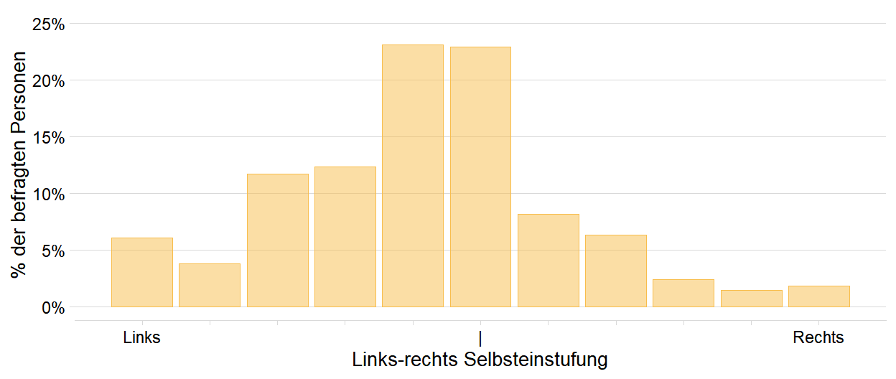<!-- --> N = 7243

<!-- -->

N = 6976

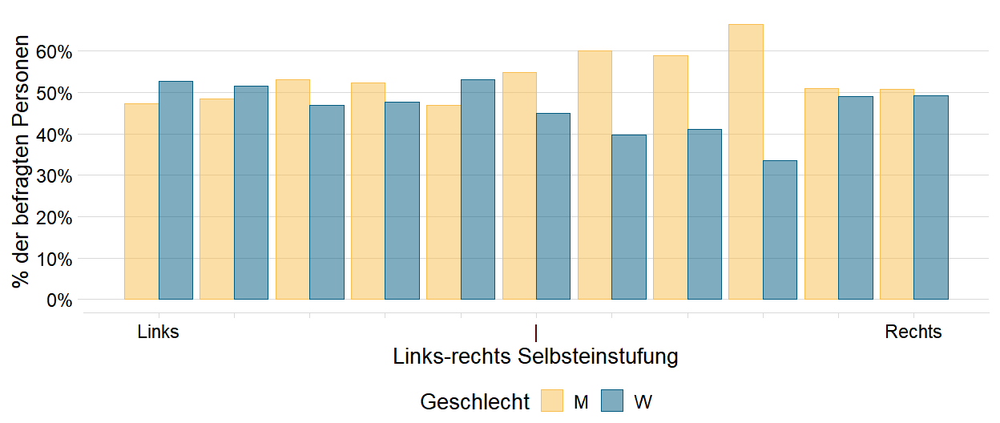<!-- --><!-- -->
N = 7243

# Sozio-ökonomische Zusammenhänge

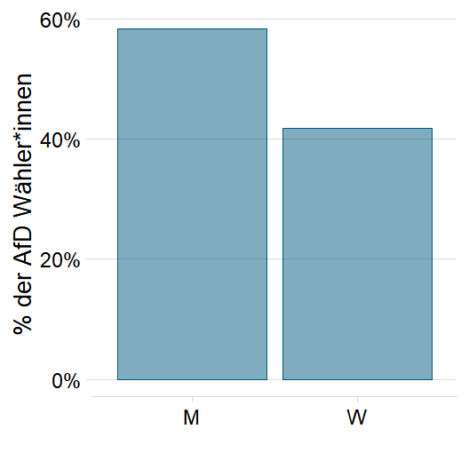<!-- --> N = 6455

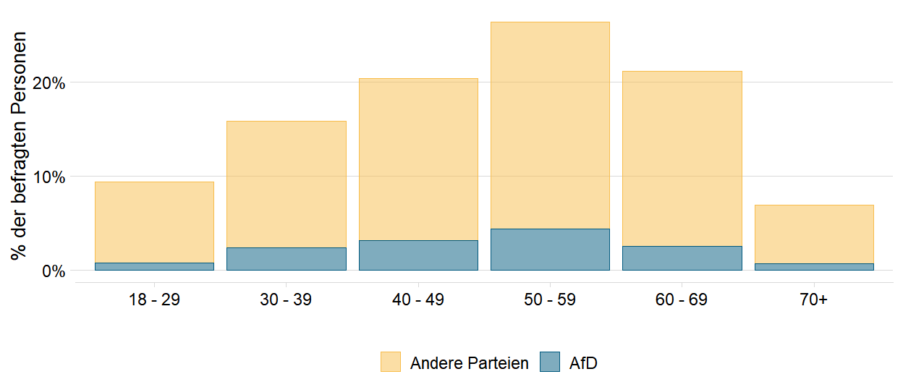<!-- --> N = 6455

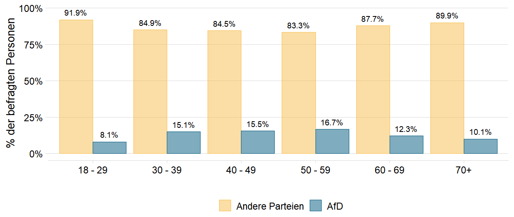<!-- -->

<!-- --> N = 6455

# Ost-West

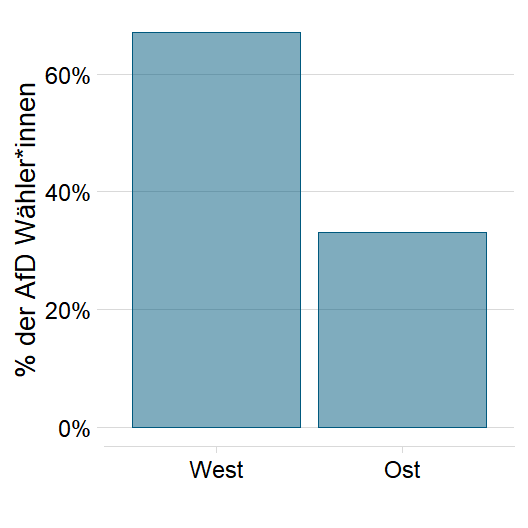<!-- --> N = 6455

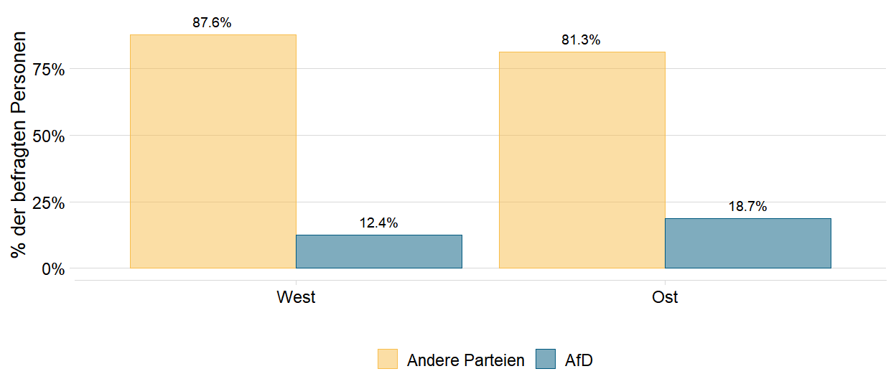<!-- -->

# Einstellungen

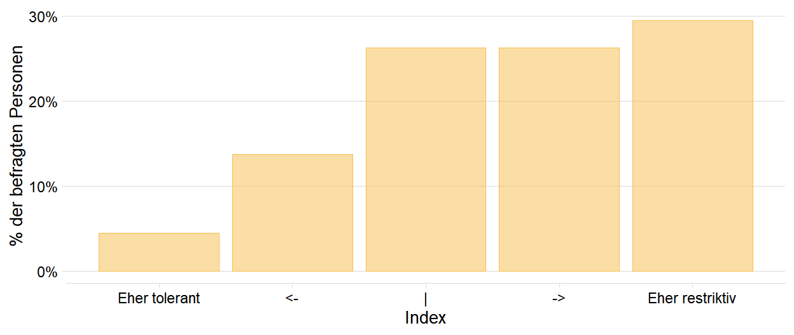<!-- --> N = 8374

<!-- -->

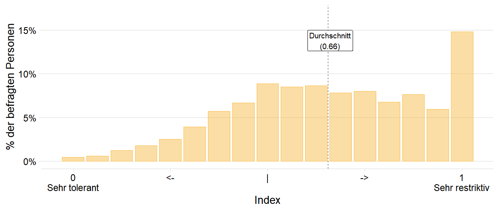<!-- -->

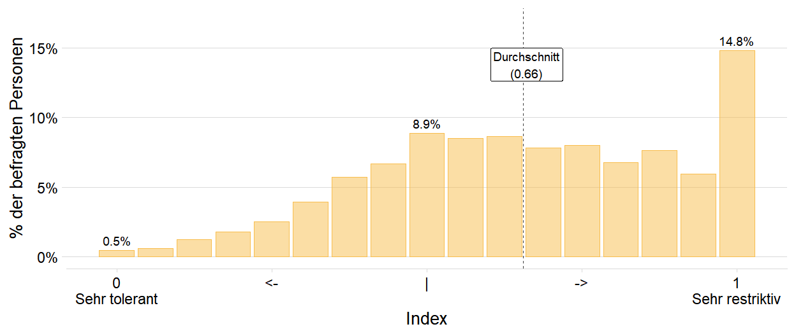<!-- -->
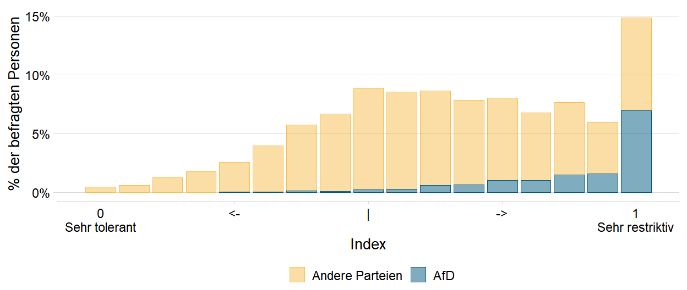<!-- -->

N = 5952

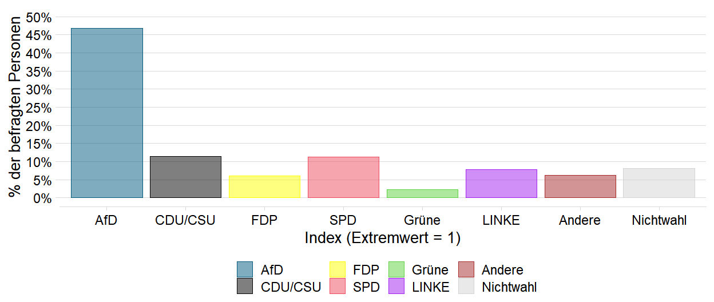<!-- -->

N = 779

<!-- --> N = 5692

# Migrationsgeschichte

<!-- -->

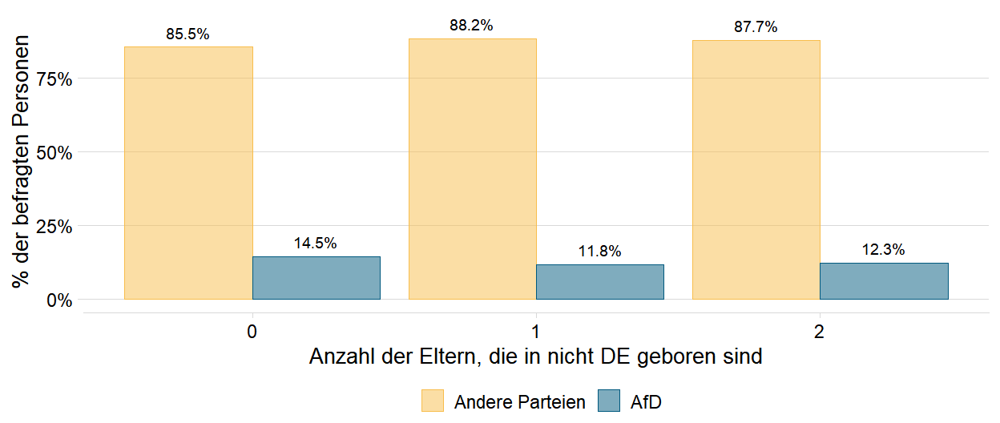<!-- --> N = 6172

<!-- -->
